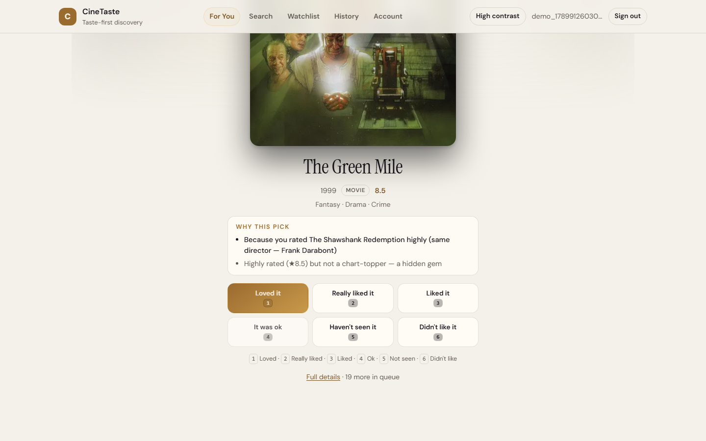
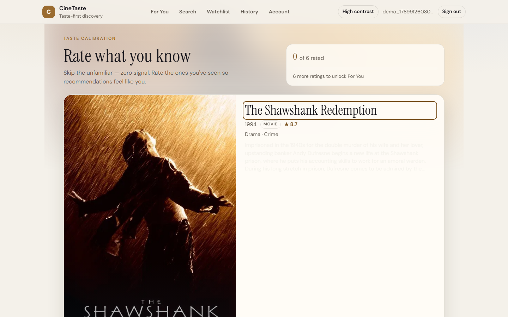
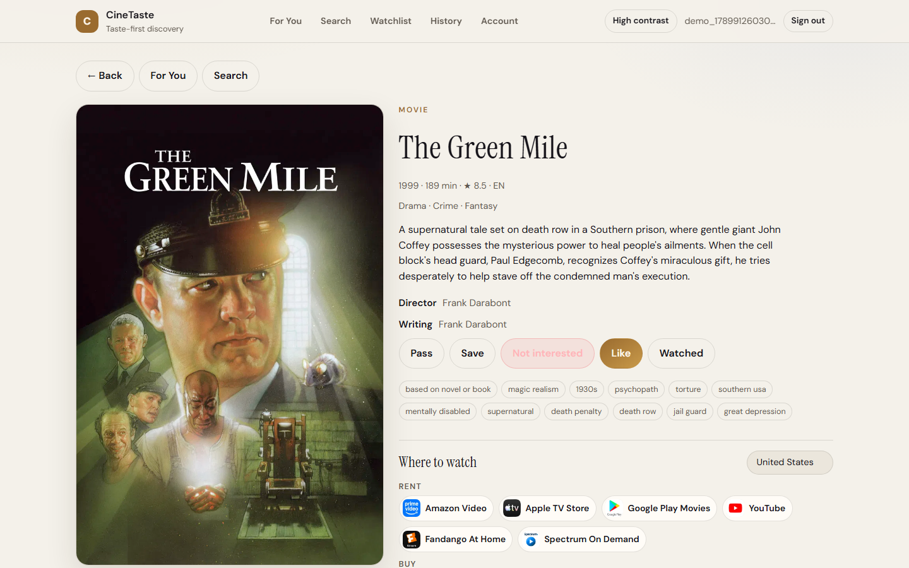
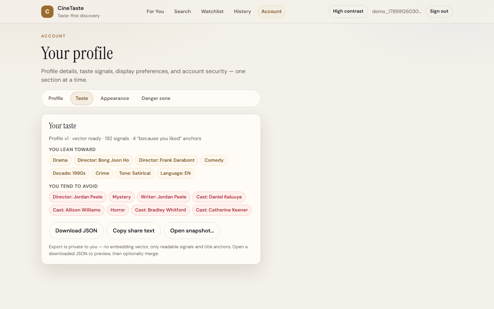
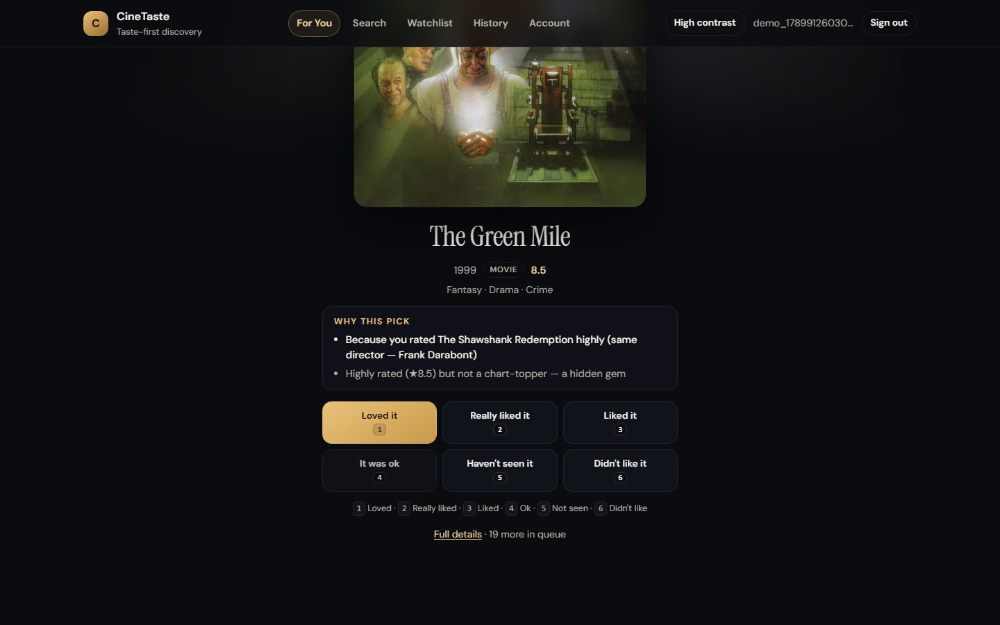

# CineTaste

A movie and TV recommender that learns what you like and **explains every pick**
in a sentence you can check.

> "Because you rated *The Shawshank Redemption* highly (same director — Frank Darabont)"

Not a TMDb browser with a search box: a taste profile that updates on every
rating, ranks a catalog against it, keeps the slate varied, and says why.



---

## Contents

- [What it does](#what-it-does) · [How the recommender works](#how-the-recommender-works)
- [Does it actually work?](#does-it-actually-work) · [Screenshots](#screenshots)
- [Run it locally](#run-it-locally) · [Architecture](#architecture) · [API](#api)
- [Testing](#testing) · [Design decisions](#design-decisions) · [Limitations](#limitations-and-whats-next)

## What it does

| | |
|---|---|
| **Low-friction onboarding** | Rate a curated deck of recognisable titles. "Haven't seen it" costs nothing and pulls in a fresh card. |
| **A taste profile, not a genre checkbox** | Every rating moves weights over genres, keywords, directors, writers, cast, tone, decade, language and country. |
| **Explained recommendations** | Every card carries reasons built from real evidence — a shared director, shared themes, a tone you keep rating highly. |
| **Discovery on purpose** | Diversity control, per-genre caps, exploration slots and hidden gems (well-rated titles that are not chart-toppers). |
| **You can inspect and undo it** | A profile page shows the signals learned, History lists every action, Undo reverses one, and the taste snapshot exports as JSON. |
| **Where to watch** | Streaming, rent and buy options per region (TMDb/JustWatch). |

## How the recommender works

```
rating ──▶ interaction_events (append-only)
             │
             ▼
   effective signal per title          latest opinion wins, time-decayed
             │
             ▼
   taste profile   ├── sparse features {"person:director:denis villeneuve": 2.1, "tone:tense": 1.4}
                   └── content vector  (384-d, pgvector)
             │
             ▼
   candidates      pgvector ANN (HNSW, cosine) + a popular slice   ~370 titles
             │
             ▼
   score = 0.2·cosine + 0.6·feature overlap − 0.12·penalty + hidden-gem + cold-start prior
             │
             ▼
   MMR (λ=0.8) ──▶ genre cap (40% of slate) ──▶ exploration slots ──▶ reasons
```

**Two representations, on purpose.** The sparse feature map is interpretable, so
explanations cite actual evidence. The dense vector makes nearest-neighbour
retrieval and diversity cheap in the database.

**The vector is a hashed content vector, not a learned embedding.** Each feature
string (`kw:heist`, `person:director:...`, meaningful synopsis words) is hashed
into one of 384 dimensions with a ±1 sign — the hashing trick. It needs no model
or vocabulary to maintain, and it can be swapped for a learned text embedding of
the same size without a schema change (`app/scripts/reembed_catalog.py`).
Popularity and ratings are deliberately *not* in it: they are ranking priors, not
content, and including them made titles "similar" because they scored alike.

**One rule for signals.** `backend/app/domain/taste_signals.py` is the single
source of truth: each event type has a weight, a polarity and a tier
(opinion > intent > implicit). Per title, the latest event of the strongest tier
wins — so like → dislike is a dislike, and "watched" after a 5-star rating
doesn't erase the rating. Older signals decay with a configurable half-life.

## Does it actually work?

Measured, not asserted: `python -m app.scripts.evaluate_recommender` replays
held-out ratings through the production ranking code and compares it with
baselines. Full method, all metrics and caveats in
[docs/EVALUATION.md](docs/EVALUATION.md).

**On real ratings (MovieLens, 193 users, slate of 20):**

| strategy | recall@20 | hit rate@20 | novelty |
|---|---|---|---|
| random | 0.001 | 0.026 | 0.511 |
| **most popular** | **0.072** | **0.415** | 0.002 |
| **production** | 0.025 | 0.254 | **0.225** |
| production + popularity prior (opt-in) | 0.049 | 0.404 | 0.044 |

The honest headline: **on MovieLens, recommending the most popular films is more
accurate than this recommender.** MovieLens only gives genres, a few tags and a
year — no cast, director or synopsis — so content-based ranking has little to
work with, and what people rate next there is dominated by popular films.

What the evaluation changed:

- It showed the hashed content vector was the weakest signal on real data, so
  weight moved to the interpretable features. On the same users, hit rate went
  from 0.155 to 0.254 and NDCG rose 65%, with no loss on the synthetic benchmark.
- A popularity prior closes most of the gap (hit rate 0.404) but mostly
  recommends the charts (novelty 0.044). For a discovery product that is the
  wrong default, so it ships switched off and documented.
- On a synthetic benchmark where taste is learnable from metadata, the same
  ranker finds 3.5× more held-out favourites than random or popular. The
  diversity controls' cost (about a third of recall) is what set the genre cap
  and MMR λ.

## Screenshots

| Onboarding | Title detail |
|---|---|
|  |  |

| Taste profile | Dark theme |
|---|---|
|  |  |

Captured from a running stack by `frontend/scripts/capture-screenshots.mjs`
(it registers, onboards and rates through the real API).

## Run it locally

**Prerequisites:** Docker Desktop, Node 20+, and a free
[TMDb API key](https://www.themoviedb.org/settings/api) for real data.

```bash
cp .env.example .env          # set JWT_SECRET (32+ chars) and TMDB_API_KEY
docker compose up --build     # API + Postgres/pgvector (+ Redis) — migrations run on start
```

Fill the catalog (either one):

```bash
# Real TMDb data: curated onboarding deck + ~800 popular and most-voted titles
docker compose exec api python -m app.scripts.ingest_catalog --pages 10

# Or, with no API key, a small synthetic catalog
docker compose exec api python -m app.scripts.seed_demo_catalog
```

Start the SPA:

```bash
cd frontend && npm install && npm run dev     # http://localhost:5173
```

- API http://localhost:8000 · docs http://localhost:8000/docs
- Health `/api/v1/health` · readiness `/api/v1/ready`
- Register → rate the onboarding deck → For You

Deployment (Render + Vercel, free tiers): [docs/DEPLOY.md](docs/DEPLOY.md).

## Architecture

```
backend/app
├── api/            FastAPI routes + Pydantic schemas (HTTP only)
├── application/    use cases: auth, taste, recommendations, ingest, watch providers
├── domain/         taste signal policy + errors (no framework, no I/O)
├── recommendation/ features, content vectors, profile, ranking, explanations, evaluation
└── infrastructure/ SQLAlchemy models, cache store, TMDb client, email
```

Dependencies point inward: routes call use cases, use cases call the domain and
infrastructure, and the domain and ranking layers import neither the database nor
FastAPI — which is why the evaluation harness can run the real ranking code
without a database.

**Stack:** Python 3.13, FastAPI, SQLAlchemy 2 (async), Alembic, PostgreSQL +
pgvector (HNSW), optional Redis, React 19 + TypeScript + Vite, Playwright, Docker,
GitHub Actions.

**Cache and rate limiting** go through one small store interface: Redis when
`REDIS_URL` is set, otherwise an in-process store. A Redis outage degrades to
in-process for 30 seconds instead of failing requests, so the free tier runs
without Redis at all.

## API

28 endpoints under `/api/v1`. Access tokens are short-lived JWTs held in memory;
the rotating refresh token lives in an httpOnly cookie scoped to `/auth`.
The threat model and the controls behind these routes are written up in
[docs/SECURITY.md](docs/SECURITY.md).

| Method | Path | Purpose |
|---|---|---|
| GET | `/health` · `/ready` | Liveness; readiness (database required, cache reported) |
| POST | `/auth/register` · `/auth/login` | Create a session |
| POST | `/auth/refresh` · `/auth/logout` | Rotate / end a session |
| POST | `/auth/forgot-password` · `/auth/reset-password` | One-time reset tokens |
| POST | `/auth/verify-email` · `/auth/resend-verification` | One-time email-ownership tokens |
| GET | `/me` · `/me/taste` · `/me/history` | Account, learned taste, activity (keyset paginated) |
| GET/POST/DELETE | `/me/taste/export` · `/me/taste/import` | Portable taste snapshot |
| DELETE | `/me` | Delete the account and its data |
| GET/POST | `/onboarding/cards` · `/onboarding/complete` | Cold-start deck and gate |
| GET | `/recommendations/for-you` | Ranked slate with reasons |
| GET | `/titles/search` · `/titles/{id}` · `/titles/{id}/similar` | Catalog (fuzzy search via pg_trgm) |
| GET | `/titles/{id}/where-to-watch` | Streaming availability by region |
| POST | `/titles/{id}/interactions` | Record a rating / save / undo |
| GET | `/watchlist` · `/catalog/status` | Saved titles; catalog readiness |

Errors share one shape: `{code, message, request_id}` (validation adds `errors[]`).

## Testing

```bash
cd backend && pytest -m "not integration"   # 203 unit tests
docker compose up -d db                      # integration needs Postgres
INTEGRATION_REQUIRED=1 pytest -m integration # 15 API + DB tests, run the migrations
cd frontend && npx playwright test           # 40 e2e + axe accessibility tests
```

Integration tests build the schema with `alembic upgrade head` (migrations are
part of what's tested) and fail rather than skip when the database is missing —
they used to skip silently and hide real failures. CI runs them twice: with and
without Redis, since production runs without.

## Design decisions

**Why not collaborative filtering?** It needs many users before it says anything,
and it can't explain itself. Content-based ranking works for user number one and
every reason it gives can be traced to a feature.

**Why two representations instead of one?** Sparse features explain; a dense
vector retrieves cheaply in the database. Which one should dominate the score
was settled by measurement, not taste: on synthetic data the vector looked
stronger (recall@20 0.163 vs 0.125), but on real MovieLens ratings the features
won clearly (0.036 vs 0.015). The score now weights features 0.6 and the vector
0.2 — the benchmark that flattered the vector was the one generated from the
same features.

**Why cap a genre at 40% of the slate?** Uncapped, a 20-card slate held barely
more than one distinct genre. The cap costs measurable recall; that trade is
made deliberately and written down rather than tuned by feel.

**Why is `rank_titles` a pure function?** It takes title-like objects and returns
ids, so unit tests, the API and the evaluation harness all exercise the same
code. Offline metrics measure what production serves.

**Why an event log plus a derived profile?** Events are append-only, so Undo is
a `clear` event rather than a destructive edit, the profile can be rebuilt after
any scoring change, and offline evaluation can replay history.

More: [docs/ARCHITECTURE.md](docs/ARCHITECTURE.md) ·
[docs/DECISIONS.md](docs/DECISIONS.md) · [docs/TASTE_SIGNALS.md](docs/TASTE_SIGNALS.md)

## Limitations and what's next

- **The content vector is hashed, not learned.** It cannot tell that "heist" and
  "robbery" are related. A sentence-transformer embedding of the same dimension
  would drop in behind `build_title_signals`.
- **No collaborative signal.** With enough users, "people who liked X also liked
  Y" would complement content-based ranking, especially for cold titles.
- **Offline metrics only measure re-finding what a user already rated.** They say
  nothing about a pleasant surprise. `recommendation_impressions` logs what was
  shown so that engagement can be measured once there is real traffic.
- **Profile recompute is O(interactions)** per rating: fine for thousands of
  interactions per user, but an incremental update is the next step.
- **Free-tier hosting sleeps.** The API cold-starts after idle; the first request
  can take ~30 seconds.

## License

MIT — see [LICENSE](LICENSE).
